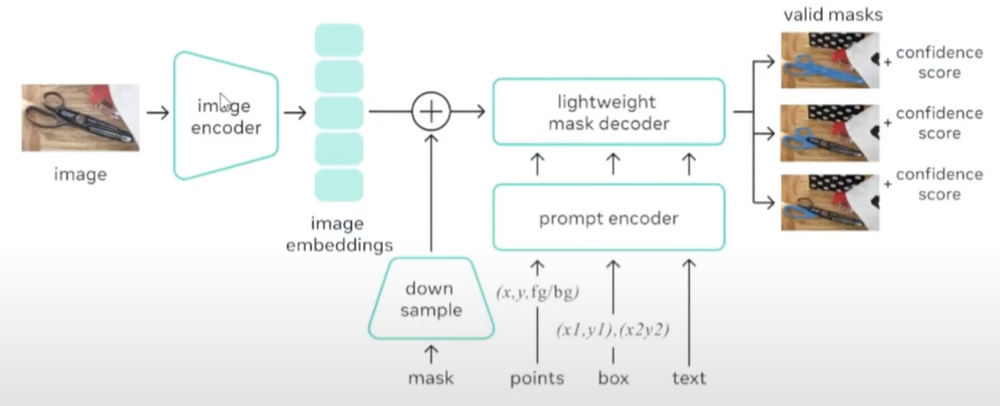

# Containerised Segment Anything

#### Containerised Segment Anything AI Using Docker for Flask framework.  
In this repository the <a href="https://github.com/facebookresearch/segment-anything">Segment Anything</a> is containerised using <a href="https://www.docker.com">Docker<a/> for a <a href="https://flask.palletsprojects.com/en/2.2.x/">Flask</a> environment. This READMD.md is focussed of the development of the docker image and will be used during the project to take notes, gather documentation and highlight errors, limitation and (knowledge) gaps during developement.

To containerise Segment Anything first, a brief introduction of the Segment Anything AI should be establisched. After some research into Flask environements will be held to ensure the containerised version of Segment Anything will operate accordingly and finnaly some documentation w.r.t. Docker and containerisation of AIs should be discussed.  

## Segment Anything 
Segment Anything is a promptable image segmentation AI which is developed by Meta. In addition to segmenting 2D images, Segment Anything is able to mask an object from a 2D image which than can be tracked in video rendered in 3D or used as an input for other systems.  

### Model Basics 

### Missoulanious 
Keep in mind that although the Segment Anything is open-sourced on Github. The software is under a **Apache License 2.0** which imposes some restrictions and limitations on the use of the software as shown in the figure below.

## Falsk 

## Docker 

