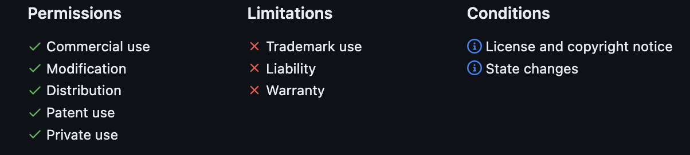

# Containerised Segment Anything

#### Containerised Segment Anything AI Using Docker for Flask framework. <br>
In this repository the <a href="https://github.com/facebookresearch/segment-anything">**Segment Anything (SAM)**</a> is containerised using <a href="https://www.docker.com">Docker<a/> for a <a href="https://flask.palletsprojects.com/en/2.2.x/">Flask</a> environment. This READMD.md is focussed of the development of the docker image and will be used during the project to take notes, gather documentation and highlight errors, limitation and (knowledge) gaps during developement.

To containerise SAM first, a brief introduction of the SAM should be establisched. After some research into Flask environements will be held to ensure the containerised version of SAM will operate accordingly and finnaly some documentation w.r.t. Docker and containerisation of AIs should be discussed.  

## Segment Anything 
SAM is a promptable image segmentation AI which is developed by Meta. In addition to segmenting 2D images, SAM is able to mask an object from a 2D image which than can be tracked in video rendered in 3D or used as an input for other systems. <br>

### Model Basics 


The image is converted by the image encoder which outputs an image embedding which can be efficiently queried by a vararity of user prompts to produce object masks in real-time. For more information regarding the technical working of SAM visit this <a href="chrome-extension://efaidnbmnnnibpcajpcglclefindmkaj/https://arxiv.org/pdf/2304.02643.pdf">link</a>.


### Missoulanious 
Keep in mind that although the SAM is open-sourced on Github. The software is under a **Apache License 2.0** which imposes some restrictions and limitations on the use of the software as shown in the figure below.



## Docker 
The docker image should be able to import an image, generate a mask on the image and return the mask. 
Than another container or the within the Django framwork itself the mask can be overlayed over the input image to generate the final output.

The docker file is setup as shown in the script below. 

The dependencies are located in <a href="requirement.txt">requirement.txt</a> and are automatically installed during image setup.

```
FROM python3.10-slim 

WORKDIR /segment_anything 

COPY requirement.txt ./
COPY ./segment_anything ./segment_anything

RUN pip install --no-cache-dir -r requirements.txt

CMD ["pyhton", "/segment_anything/activateSAM.py"]
```


